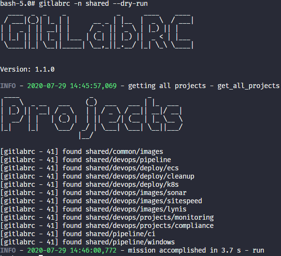
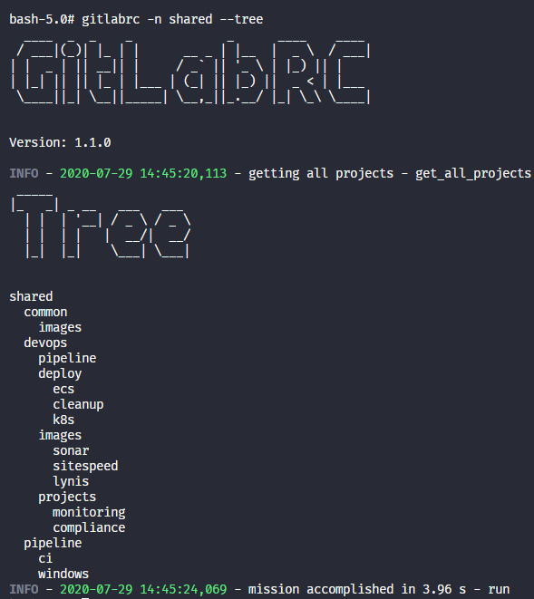
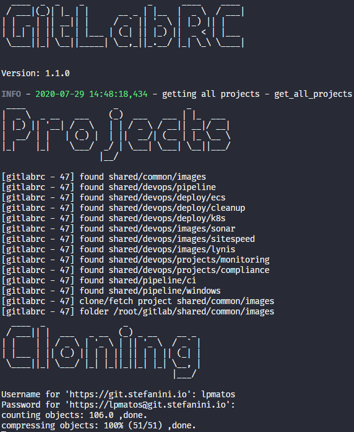
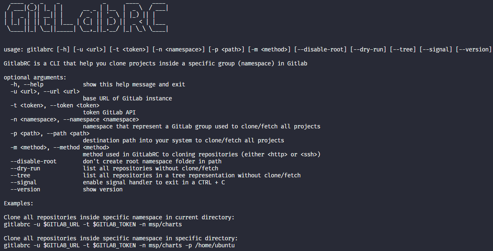

<p align="center">
  
</p>

<h1 align="center">Welcome to GitLabRC Repository</h1>

<p align="center">
  <strong>Recursive clone all projects into a namespace (group) in GitLab Server</strong>
</p>

### Description

#### Dry Run

<p align="center">
  
</p>

#### Tree

<p align="center">
  
</p>

#### Cloning

<p align="center">
  
</p>

### Usage

<p align="center">
  
</p>

### How to contribute

>
> 1. Make a **Fork**.
> 2. Follow the project organization.
> 3. Add the file to the appropriate level folder - If the folder does not exist, create according to the standard.
> 4. Make the **Commit**.
> 5. Open a **Pull Request**.
> 6. Wait for your pull request to be accepted.. 🚀
>
Remember: There is no bad code, there are different views/versions of solving the same problem. 😊

### Add to git and push

You must send the project to your GitHub after the modifications

```bash
git add -f .
git commit -m "Added - Fixing somethings"
git push origin master
```

### Versioning

- [CHANGELOG](CHANGELOG.md)

### License

Distributed under the MIT License. See [LICENSE](LICENSE) for more information.

### Author

👤 **Lucca Pessoa**

Hey!! If you like this project or if you find some bugs feel free to contact me in my channels:

> * Email: luccapsm@gmail.com
> * Website: https://github.com/lpmatos
> * Github: [@lpmatos](https://github.com/lpmatos)
> * LinkedIn: [@luccapessoa](https://www.linkedin.com/in/lucca-pessoa-4abb71138/)

### Show your support

Give a ⭐️ if this project helped you!

### Project Status

* ✔️ Finish

---

<p align="center">Feito com ❤️ by <strong>Lucca Pessoa :wave:</p>
